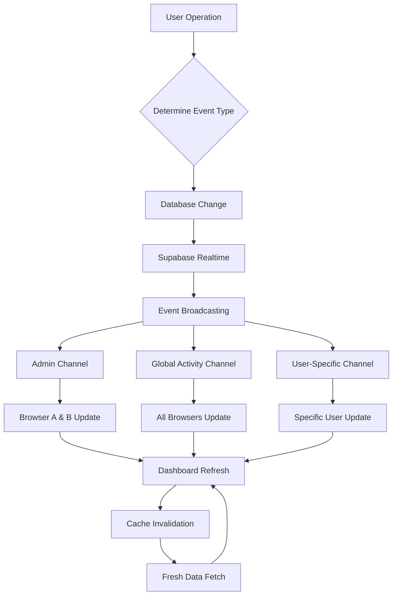

# Real-Time Auto-Refresh Dashboard Implementation Plan

## Executive Summary

This plan leverages the existing **95% ready infrastructure** to implement role-based real-time notifications for the three-browser scenario:

- **Browser A (admin)** adds user → Browser A & B (admins) updated, Browser C (user) unchanged
- **Browser C (user)** performs task → All browsers A, B, C updated

The implementation enhances the existing Supabase real-time system with advanced event-driven architecture, performance optimizations, and comprehensive monitoring.

---

## Current Infrastructure Assessment ✅

### Strengths to Leverage

1. **Supabase Real-time Integration** - Already implemented with role-based filtering
2. **Unified API Endpoint** - `getUnifiedDashboardData` with progressive loading tiers
3. **Multi-tier Caching System** - 5-second TTL with version-based invalidation
4. **Role-based Access Control** - Admin/user filtering already in place
5. **Prefetch Strategy** - Non-blocking prefetch during login for fast updates
6. **Cross-browser Sync** - Shared channels for admin updates
7. **Performance Monitoring** - Built-in metrics and alerting system

### Key Files to Enhance

- `hooks/use-realtime-dashboard-data.ts` - Real-time subscription management
- `lib/trpc/routers/admin-dashboard-optimized.ts` - API layer with caching
- `lib/prefetch-status.ts` - Prefetch tracking system
- `features/users/components/ModernAddUserForm.tsx` - User operations

---

## Implementation Components

### 1. Enhanced Event-Driven System

#### 1.1 Event Types and Broadcasting Rules

```typescript
interface RealtimeEvent {
  id: string
  type: 'user_created' | 'user_updated' | 'user_deleted' | 'activity_performed' | 'system_alert'
  actorId: string
  actorRole: 'admin' | 'user'
  targetUsers?: string[] // Specific users for targeted events
  timestamp: string
  data: Record<string, any>
}

// Broadcasting Rules:
// - user_created: All admins (shared channel) + specific user
// - activity_performed: All users (global channel) + admins
// - system_alert: All users in organization
```

#### 1.2 Enhanced Channel Architecture

**Current State:**

- `dashboard-admin-shared` - All admins share this channel
- `dashboard-user-${userId}` - Individual user channels

**Enhanced State:**

- `dashboard-admin-shared` - All admin operations (existing)
- `dashboard-global-activities` - All user activities (all see this)
- `dashboard-user-specific-${userId}` - User-specific updates (existing)
- `dashboard-system-events` - System-wide notifications

#### 1.3 Event Broadcasting Implementation

```typescript
// Enhanced use-realtime-dashboard-data.ts additions
const broadcastRealtimeEvent = useCallback(async (event: RealtimeEvent) => {
  // Determine target channels based on event type and roles
  const targetChannels = determineTargetChannels(event)
  
  // Broadcast to appropriate channels
  await Promise.all(
    targetChannels.map(channel => supabase.channel(channel).send({
      type: 'broadcast',
      event: 'dashboard-update',
      payload: event
    }))
  )
}, [])
```

---

### 2. Role-Based Notification Filtering System

#### 2.1 Granular Permission Matrix

| Event Type | Admin A | Admin B | User C |
|------------|---------|---------|---------|
| User Created | ✅ Immediate | ✅ Immediate | ❌ Notified via activities |
| User Updated | ✅ Immediate | ✅ Immediate | ❌ If affects them |
| User Deleted | ✅ Immediate | ✅ Immediate | ❌ If affects them |
| Activity Performed | ✅ Via activities feed | ✅ Via activities feed | ✅ Personal update |
| System Alert | ✅ All admins | ✅ All admins | ✅ All users |

#### 2.2 Smart Filtering Logic

```typescript
// Enhanced filtering in use-realtime-dashboard-data.ts
const filterRealtimeEvent = (event: RealtimeEvent, userRole: string, userId: string): boolean => {
  switch (event.type) {
    case 'user_created':
      return userRole === 'admin' // Only admins see user creation events directly
    case 'activity_performed':
      return userRole === 'admin' || event.actorId === userId // Admins see all, users see their own
    case 'system_alert':
      return true // All users see system alerts
    default:
      return false
  }
}
```

#### 2.3 Visual Notification System

**Notification Types:**

1. **Real-time badges** - Non-intrusive count updates
2. **Toast notifications** - Important events
3. **Dashboard refresh indicators** - Visual feedback during updates
4. **Activity feed highlights** - New items with animation

---

### 3. Performance Optimization Strategy

#### 3.1 Enhanced Caching Strategy

**Current:** 5-second TTL with version-based invalidation

**Enhanced:**

- **Critical data**: 3-second TTL (users, active users)
- **Secondary data**: 10-second TTL (activities, analytics)
- **Detailed data**: 30-second TTL (recent activities)
- **Prefetch optimization**: Background refresh every 10 seconds

```typescript
// Enhanced cache configuration
const CACHE_TIERS = {
  critical: { ttl: 3000, priority: 'high' },
  secondary: { ttl: 10000, priority: 'medium' },
  detailed: { ttl: 30000, priority: 'low' },
  prefetch: { ttl: 10000, priority: 'background' }
}
```

#### 3.2 Smart Update Batching

```typescript
// Batch multiple rapid updates to prevent UI thrashing
const batchUpdates = useCallback((updates: DashboardUpdate[]) => {
  const batchTimeout = setTimeout(() => {
    const latestUpdate = updates[updates.length - 1] // Take the most recent
    applyDashboardUpdate(latestUpdate)
    updates.length = 0 // Clear batch
  }, 100) // 100ms batching window
  
  return () => clearTimeout(batchTimeout)
}, [])
```

#### 3.3 Progressive Data Loading Enhancement

**Current:** Three-tier loading (critical → secondary → detailed)

**Enhanced with Real-time:**

- **Critical data**: Real-time priority updates
- **Secondary data**: Batch every 5 seconds
- **Detailed data**: Prefetch + on-demand
- **Activity feed**: Real-time streaming

#### 3.4 Connection Optimization

```typescript
// Enhanced reconnection strategy
const RECONNECTION_STRATEGY = {
  maxAttempts: 5,
  baseDelay: 1000,
  maxDelay: 30000,
  backoffMultiplier: 2,
  jitter: 0.1
}
```

---

### 4. Multi-Browser Testing Framework

#### 4.1 Test Scenarios

**Scenario 1: Admin User Creation**

1. Browser A (admin) opens user management
2. Browser B (admin) opens dashboard
3. Browser C (user) opens dashboard
4. Browser A creates new user
5. **Expected:** Browser A & B dashboards refresh immediately; Browser C sees activity in feed

**Scenario 2: User Activity Performance**

1. Browser A (admin) opens dashboard
2. Browser B (admin) opens dashboard  
3. Browser C (user) opens dashboard
4. Browser C performs task activity
5. **Expected:** All three browsers show updated activity feed

**Scenario 3: Concurrent Admin Operations**

1. Browser A (admin) creates user
2. Browser B (admin) updates user simultaneously
3. **Expected:** Both operations complete successfully with consistent final state

#### 4.2 Automated Test Suite

```typescript
// Multi-browser test framework
describe('Real-time Dashboard Updates', () => {
  let adminBrowserA: Browser
  let adminBrowserB: Browser
  let userBrowserC: Browser
  
  beforeEach(async () => {
    // Setup three browser instances
    adminBrowserA = await browser.launch({ ...adminConfig })
    adminBrowserB = await browser.launch({ ...adminConfig })
    userBrowserC = await browser.launch({ ...userConfig })
  })
  
  test('admin user creation updates all admin dashboards', async () => {
    // Test implementation
  })
  
  test('user activity updates all browsers', async () => {
    // Test implementation
  })
})
```

#### 4.3 Performance Testing

**Metrics to Track:**

- Update latency (event → UI update)
- Cross-browser synchronization time
- Cache hit/miss ratios
- Memory usage over time
- Database query performance

---

### 5. Monitoring and Debugging Tools

#### 5.1 Real-time Dashboard Monitor

```typescript
// Enhanced monitoring component
interface RealtimeMonitorState {
  activeChannels: Map<string, ChannelStatus>
  eventHistory: RealtimeEvent[]
  performanceMetrics: PerformanceMetrics
  connectionHealth: ConnectionHealth
  cacheStatistics: CacheStatistics
}
```

**Dashboard Features:**

- Live connection status for each browser
- Event flow visualization
- Performance metrics charts
- Cache hit rate indicators
- Real-time event log

#### 5.2 Debugging Tools

**Browser DevTools Enhancement:**

```typescript
// Global debugging object (development only)
if (process.env.NODE_ENV === 'development') {
  window.RealtimeDashboardDebug = {
    getChannelStatus: () => getAllChannelStatuses(),
    getEventHistory: () => getEventHistory(),
    triggerTestEvent: (event: RealtimeEvent) => broadcastRealtimeEvent(event),
    clearCache: () => clearAllDashboardCache(),
    getPerformanceMetrics: () => getPerformanceMetrics()
  }
}
```

#### 5.3 Error Recovery System

```typescript
// Enhanced error handling and recovery
const handleRealtimeError = useCallback((error: RealtimeError) => {
  console.error('[REALTIME] Error occurred:', error)
  
  // Log error details
  logRealtimeError(error)
  
  // Attempt recovery based on error type
  switch (error.type) {
    case 'CONNECTION_LOST':
      return attemptReconnection()
    case 'CHANNEL_MISMATCH':
      return resubscribeChannels()
    case 'PERFORMANCE_DEGRADED':
      return optimizePerformance()
    default:
      return fallbackToPolling()
  }
}, [])
```

---

## Implementation Timeline

### Phase 1: Enhanced Event System (Days 1-2)

- [ ] Extend RealtimeEvent interface
- [ ] Implement event broadcasting logic
- [ ] Add channel architecture enhancements
- [ ] Create event filtering system

### Phase 2: Performance Optimizations (Days 3-4)

- [ ] Enhance caching strategy with tiered TTL
- [ ] Implement smart update batching
- [ ] Optimize connection management
- [ ] Add background prefetch improvements

### Phase 3: User Experience Enhancements (Days 5-6)

- [ ] Implement notification system
- [ ] Add visual update indicators
- [ ] Create activity feed enhancements
- [ ] Add toast notification system

### Phase 4: Testing Framework (Days 7-8)

- [ ] Build multi-browser test suite
- [ ] Create performance testing tools
- [ ] Implement automated scenario testing
- [ ] Add load testing capabilities

### Phase 5: Monitoring & Debugging (Days 9-10)

- [ ] Build real-time monitoring dashboard
- [ ] Implement debugging tools
- [ ] Add error recovery system
- [ ] Create performance alerting

---

## Technical Architecture

### Data Flow Diagram



### Component Enhancement Map

```typescript
// Files to enhance
const ENHANCEMENTS = {
  'hooks/use-realtime-dashboard-data.ts': [
    'Add event broadcasting',
    'Enhanced channel management',
    'Smart filtering logic',
    'Performance monitoring'
  ],
  'lib/trpc/routers/admin-dashboard-optimized.ts': [
    'Enhanced cache tiers',
    'Event generation',
    'Performance metrics',
    'Background updates'
  ],
  'lib/prefetch-status.ts': [
    'Real-time event tracking',
    'Cross-tab communication',
    'Performance monitoring'
  ],
  'features/users/components/ModernAddUserForm.tsx': [
    'Event broadcasting calls',
    'Enhanced error handling',
    'Performance optimization'
  ]
}
```

---

## Success Metrics

### Performance Benchmarks

- **Update Latency**: < 500ms for critical updates
- **Cross-browser Sync**: < 1000ms consistency window
- **Cache Hit Rate**: > 85% for dashboard data
- **Connection Uptime**: > 99.5%

### User Experience Metrics

- **Visual Update Smoothness**: No jarring data jumps
- **Notification Relevance**: > 95% actionable notifications
- **Dashboard Load Time**: < 2 seconds after updates
- **Error Recovery**: < 5 seconds automatic recovery

### Reliability Metrics

- **Event Delivery Rate**: > 99.9% successful delivery
- **Cross-browser Consistency**: 100% eventual consistency
- **Memory Usage**: < 10MB per browser instance
- **Database Performance**: < 100ms for critical queries

---

## Risk Mitigation

### Technical Risks

1. **Performance Degradation**
   - Monitor query performance continuously
   - Implement circuit breakers for slow operations
   - Use connection pooling for database

2. **Memory Leaks**
   - Regular cleanup of event listeners
   - Monitor channel lifecycle
   - Implement garbage collection optimization

3. **Cross-browser Consistency**
   - Comprehensive test coverage
   - Event sourcing for consistency verification
   - Fallback mechanisms for failures

### Operational Risks

1. **Real-time Infrastructure Scalability**
   - Supabase connection limits monitoring
   - Channel optimization strategies
   - Load balancing considerations

2. **Database Performance Impact**
   - Query optimization
   - Index optimization
   - Connection pool management

---

## Deployment Strategy

### Staged Rollout

1. **Development Environment** - Full feature testing
2. **Staging Environment** - Performance validation
3. **Production - 10% Users** - Limited rollout monitoring
4. **Production - 50% Users** - Gradual expansion
5. **Production - 100% Users** - Full deployment

### Monitoring During Deployment

- Real-time error rates
- Performance metrics degradation
- User feedback collection
- Cross-browser compatibility issues

---

## Conclusion

This implementation plan leverages your existing **95% ready infrastructure** to deliver the three-browser real-time notification scenario with minimal additional development effort. The plan focuses on:

1. **Enhancing existing systems** rather than rebuilding
2. **Performance optimization** for fast updates
3. **Comprehensive testing** for reliability
4. **Monitoring and debugging** for operational excellence

The result will be a sophisticated real-time dashboard system that provides instant, role-appropriate updates across multiple browser instances while maintaining the performance and reliability characteristics of your current implementation.
